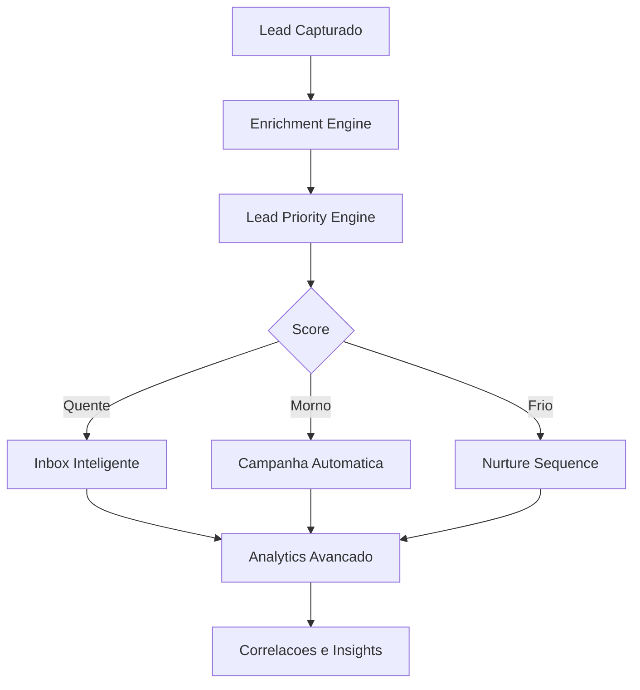
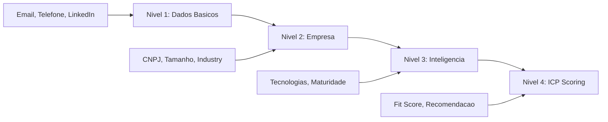
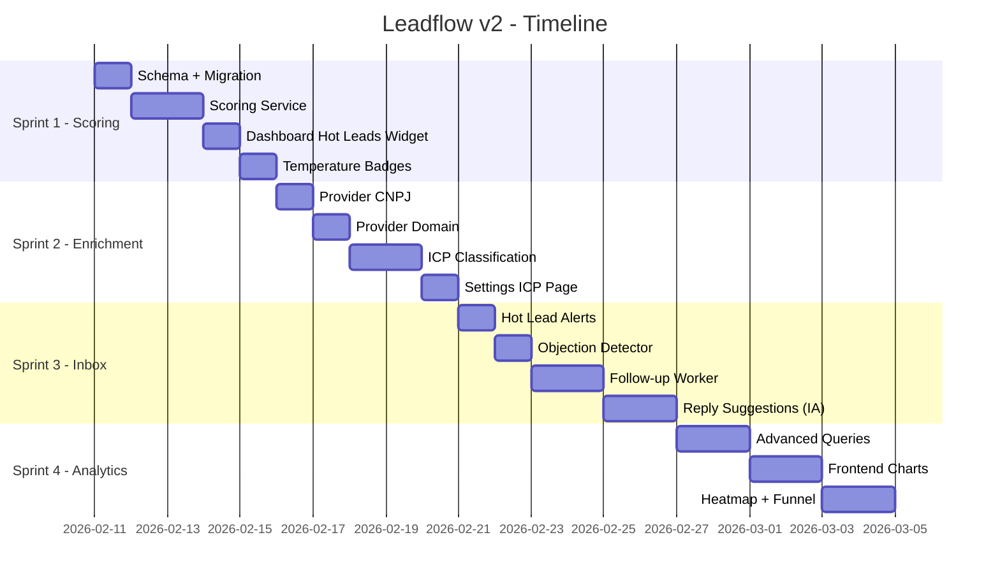

# Leadflow v2 - Plano de Desenvolvimento: Inteligencia e Decisao

> De ferramenta de execucao para **motor de decisao comercial**.

---

## Visao Geral



---

## 1. Lead Priority Engine

> **Objetivo:** Dar ao SDR uma resposta clara: *"o que fazer agora?"*

### 1.1 Schema Changes

```diff
model Lead {
  // Campos existentes
  score           Int?     // 0-100 (ja existe)
  icpMatch        Float?   // 0-1 (ja existe)

  // Novos campos
+ temperature     LeadTemperature @default(COLD)
+ lastInteraction DateTime?
+ lastScoreUpdate DateTime?
+ scoreBreakdown  Json?    // { enrichment: 25, interaction: 30, timing: 20, icp: 25 }
}

+enum LeadTemperature {
+  HOT
+  WARM
+  COLD
+}
```

### 1.2 Algoritmo de Scoring

| Dimensao | Peso | Sinais |
|----------|------|--------|
| **Enrichment** | 25% | Email verificado, LinkedIn, telefone, dados empresa |
| **Interacao** | 30% | Abriu email, clicou link, respondeu, WhatsApp lido |
| **Timing** | 20% | Recencia da interacao, frequencia, velocidade de resposta |
| **ICP Fit** | 25% | Industry match, cargo, tamanho empresa, localizacao |

**Regras de Temperatura:**
- **HOT (70-100):** Respondeu nos ultimos 3 dias OU score >= 70
- **WARM (40-69):** Abriu email/WhatsApp na ultima semana OU score 40-69
- **COLD (0-39):** Sem interacao > 14 dias OU score < 40

### 1.3 Arquivos

| Arquivo | Descricao |
|---------|-----------|
| `backend/src/modules/scoring/scoring.service.ts` | Calculo de score e temperatura |
| `backend/src/modules/scoring/scoring.worker.ts` | BullMQ worker para recalcular scores em batch |
| `backend/src/modules/scoring/scoring.routes.ts` | `GET /api/scoring/leaderboard`, `POST /api/scoring/recalculate` |
| `frontend/app/dashboard/page.tsx` | Widget "Leads Quentes Agora" no topo |
| `frontend/components/leads/lead-temperature.tsx` | Badge visual (fire/sun/snow) |
| `frontend/components/dashboard/hot-leads-widget.tsx` | Lista prioritizada com acoes rapidas |

### 1.4 Frontend - Dashboard Redesign

```
+--------------------------------------------------+
| LEADS QUENTES AGORA                    Ver todos > |
| +------+ +------+ +------+ +------+              |
| | Joao | | Maria| | Pedro| | Ana  |              |
| | 92   | | 87   | | 81   | | 75   |              |
| | Email | | WA   | | Call | | Email|              |
| +------+ +------+ +------+ +------+              |
+--------------------------------------------------+
```

---

## 2. Enrichment Engine Avancado

> **Objetivo:** Transformar enriquecimento de "completar dados" em **classificacao inteligente**.

### 2.1 Niveis de Enrichment



### 2.2 Schema Changes

```diff
model Lead {
  enrichmentData  Json?    // (ja existe - expandir estrutura)

  // Novos campos estruturados
+ companyRevenue    String?
+ companyEmployees  String?    // "1-10", "11-50", "51-200", etc
+ technologies      String[]   // ["wordpress", "hubspot", "salesforce"]
+ maturityLevel     MaturityLevel?
+ icpReasons        String[]   // ["industry_match", "size_match", "tech_fit"]
}

+enum MaturityLevel {
+  EARLY_STAGE
+  GROWING
+  ESTABLISHED
+  ENTERPRISE
+}
```

### 2.3 Pipeline de Enrichment

| Etapa | Fonte | Dados |
|-------|-------|-------|
| **CNPJ Lookup** | ReceitaWS / BrasilAPI | Razao social, porte, CNAE, socios |
| **Domain Analysis** | BuiltWith / Wappalyzer API | Stack tecnologica, CMS, analytics |
| **LinkedIn Scraping** | Existente | Cargo, senioridade, conexoes |
| **Company Size** | CNPJ + LinkedIn | Numero de funcionarios, faturamento |
| **ICP Classification** | Regras + ML simples | Fit score com justificativa |

### 2.4 Arquivos

| Arquivo | Descricao |
|---------|-----------|
| `backend/src/modules/enrichment/enrichment.service.ts` | **Modificar** - adicionar niveis |
| `backend/src/modules/enrichment/providers/cnpj.provider.ts` | Lookup via BrasilAPI |
| `backend/src/modules/enrichment/providers/domain.provider.ts` | Analise de dominio/tecnologias |
| `backend/src/modules/enrichment/providers/icp.provider.ts` | Classificacao ICP |
| `frontend/components/leads/enrichment-card.tsx` | Card visual com progresso de enriquecimento |
| `frontend/app/settings/icp/page.tsx` | Config do perfil ICP ideal |

### 2.5 ICP Configuration (Settings)

O usuario define seu ICP ideal:

```json
{
  "industries": ["tecnologia", "saas", "fintech"],
  "companySizes": ["11-50", "51-200"],
  "seniorityLevels": ["director", "c-level", "vp"],
  "locations": ["SP", "RJ", "MG"],
  "technologies": ["hubspot", "salesforce"],
  "customRules": [
    { "field": "companyRevenue", "operator": "gte", "value": "1M" }
  ]
}
```

---

## 3. Inbox Inteligente

> **Objetivo:** Inbox proativo que ajuda o SDR a responder melhor e mais rapido.

### 3.1 Features por Prioridade

| # | Feature | Tipo | Complexidade |
|---|---------|------|-------------|
| 1 | **Alerta de lead quente** | Rule-based | Baixa |
| 2 | **Sugestao de resposta** | IA (GPT) | Media |
| 3 | **Deteccao de objecoes** | Keywords + IA | Media |
| 4 | **Follow-up automatico** | Rule-based + Cron | Media |
| 5 | **Sentiment analysis** | IA | Alta |

### 3.2 Alerta de Lead Quente

Quando um lead **HOT** responde:
- Notification push no NotificationCenter
- Badge especial na conversa
- Toast na tela do SDR

```typescript
// Trigger: Quando recebe mensagem INBOUND
if (lead.temperature === 'HOT') {
  await notificationService.create({
    organizationId,
    userId: lead.assignedToUserId,
    title: '🔥 Lead quente respondeu!',
    message: `${lead.fullName} acabou de responder`,
    type: 'LEAD_HOT_REPLY',
    data: { leadId: lead.id }
  });
}
```

### 3.3 Sugestao de Resposta

```
+-------------------------------------------+
| Joao Silva respondeu:                     |
| "Achei interessante, mas o preco esta     |
|  acima do nosso orcamento atual."         |
+-------------------------------------------+
| SUGESTOES:                                |
| [1] Negociar valor com desconto           |
| [2] Oferecer plano mais basico            |
| [3] Agendar call para entender contexto   |
|                                           |
| Objecao detectada: PRECO                  |
+-------------------------------------------+
```

### 3.4 Follow-up Automatico Inteligente

| Regra | Acao | Delay |
|-------|------|-------|
| Lead HOT sem resposta | Alerta SDR + sugerir follow-up | 24h |
| Lead WARM sem resposta | Enviar follow-up automatico | 3 dias |
| Lead COLD sem resposta | Adicionar em nurture campaign | 7 dias |
| Lead respondeu com objecao | Sugerir template de contorno | Imediato |

### 3.5 Arquivos

| Arquivo | Descricao |
|---------|-----------|
| `backend/src/modules/inbox/inbox-intelligence.service.ts` | Logica de sugestoes e alertas |
| `backend/src/modules/inbox/followup.worker.ts` | Worker BullMQ para follow-ups |
| `backend/src/modules/inbox/objection-detector.ts` | Detector de objecoes (keywords) |
| `frontend/components/inbox/reply-suggestions.tsx` | UI de sugestoes |
| `frontend/components/inbox/hot-lead-alert.tsx` | Alerta visual na conversa |
| `frontend/components/inbox/objection-badge.tsx` | Badge de objecao detectada |
| `frontend/app/inbox/page.tsx` | **Modificar** - integrar componentes |

---

## 4. Analytics Avancado

> **Objetivo:** Sair de metricas basicas para **correlacoes que geram insight comercial**.

### 4.1 Metricas de Correlacao

| Metrica | Query | Valor para o SDR |
|---------|-------|-------------------|
| **Fonte -> Reunioes** | Source que gera mais respostas | Saber onde investir |
| **Mensagem -> Conversao por segmento** | Template + Industry -> reply rate | Saber o que escrever |
| **Melhor horario por ICP** | Hour(sentAt) + Lead.industry -> open rate | Saber quando enviar |
| **Tempo medio ate resposta** | AVG(reply.createdAt - sent.createdAt) | Benchmark de performance |
| **Score -> Conversao** | Lead.score range -> reply rate | Validar o scoring |

### 4.2 Schema Changes

```diff
model Message {
  // Campos existentes

  // Novos para tracking
+ responseTime    Int?       // Segundos ate a resposta
+ campaignStepId  String?    // Link com CampaignStep
}

model Campaign {
  // Novos campos de metricas agregadas
+ metrics         Json?      // { openRate, replyRate, bounceRate, avgResponseTime }
+ lastMetricsAt   DateTime?
}
```

### 4.3 Novos Endpoints

| Endpoint | Descricao |
|----------|-----------|
| `GET /api/analytics/source-performance` | Performance por fonte de leads |
| `GET /api/analytics/message-performance` | Performance por template/tipo |
| `GET /api/analytics/timing-heatmap` | Mapa de calor: melhor horario por segmento |
| `GET /api/analytics/response-time` | Tempo medio de resposta |
| `GET /api/analytics/score-correlation` | Correlacao score vs conversao |
| `GET /api/analytics/funnel` | Funil completo: lead -> enriched -> contacted -> replied -> converted |

### 4.4 Frontend - Dashboard Analytics

```
+--------------------------------------------------+
| PERFORMANCE POR FONTE                             |
| Google Maps ████████████ 23% reply rate           |
| LinkedIn    ██████████ 19% reply rate             |
| CNPJ        ██████ 12% reply rate                 |
+--------------------------------------------------+
| MELHOR HORARIO (Heatmap)                          |
| 09h ██████████ (SaaS/Tech)                        |
| 14h ████████████ (Varejo)                         |
| 17h ████ (Servicos)                               |
+--------------------------------------------------+
| FUNIL DE CONVERSAO                                |
| Capturados  ████████████████████ 1,234            |
| Enriched    ██████████████████ 1,100 (89%)        |
| Contatados  ████████████████ 890 (72%)            |
| Responderam █████████ 445 (36%)                   |
| Convertidos ████ 112 (9%)                         |
+--------------------------------------------------+
```

### 4.5 Arquivos

| Arquivo | Descricao |
|---------|-----------|
| `backend/src/modules/analytics/analytics.service.ts` | **Modificar** - adicionar queries avancadas |
| `backend/src/modules/analytics/analytics.worker.ts` | Worker para calcular metricas em batch |
| `backend/src/modules/analytics/analytics.routes.ts` | **Modificar** - novos endpoints |
| `frontend/app/analytics/page.tsx` | **Criar** - pagina dedicada de analytics |
| `frontend/components/analytics/source-chart.tsx` | Grafico de performance por fonte |
| `frontend/components/analytics/timing-heatmap.tsx` | Heatmap de horarios |
| `frontend/components/analytics/funnel-chart.tsx` | Funil visual |
| `frontend/components/analytics/response-time.tsx` | Metrica de tempo de resposta |

---

## Roadmap de Implementacao



### Ordem de Prioridade

| Sprint | Feature | Impacto | Esforco | Prioridade |
|--------|---------|---------|---------|------------|
| **1** | Lead Priority Engine | Muito Alto | Medio | P0 |
| **2** | Enrichment Avancado | Alto | Medio | P1 |
| **3** | Inbox Inteligente | Alto | Alto | P1 |
| **4** | Analytics Avancado | Medio | Medio | P2 |

---

## Dependencias Tecnicas

| Dependencia | Uso | Status |
|-------------|-----|--------|
| BullMQ + Redis | Workers de scoring/follow-up | Ja instalado |
| OpenAI API | Sugestoes de resposta, deteccao de objecoes | Precisa configurar |
| BrasilAPI | CNPJ enrichment | Gratuito, sem key |
| Recharts / Nivo | Graficos no frontend | Precisa instalar |

---

## Decisoes que Precisam de Input

> [!IMPORTANT]
> **1. OpenAI API Key:** Para sugestoes de resposta e deteccao de objecoes, precisamos configurar uma API key da OpenAI (ou alternativa como Groq/Anthropic). Qual provider prefere?

> [!IMPORTANT]
> **2. Frequencia de Recalculo de Score:** Recalcular scores em real-time (mais preciso, mais custo) ou em batch a cada 15min (mais eficiente)?

> [!IMPORTANT]
> **3. Prioridade de Sprints:** A ordem proposta e Scoring -> Enrichment -> Inbox -> Analytics. Quer alterar a prioridade?
