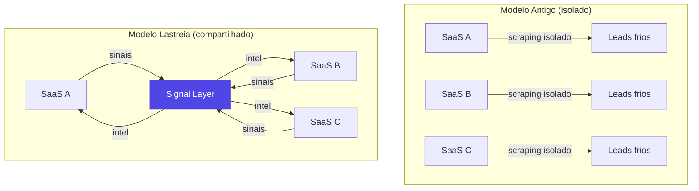
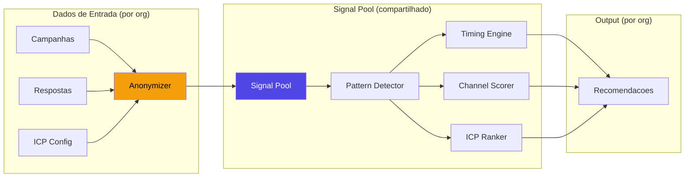

                                                                                                            # Lastreia - Novo Posicionamento Estrategico

> **De:** "Ferramenta para conseguir clientes"
> **Para:** "Acquisition as Infrastructure for B2B SaaS"

---

## O Problema Real

Todo SaaS B2B pequeno sofre com:
- CAC alto
- Outbound cansativo e repetitivo
- Leads frios que nunca convertem
- Aprender tudo sozinho por tentativa e erro

**Mas todos eles:**
- Falam com ICPs parecidos
- Disputam os mesmos decisores
- Geram sinais de mercado parecidos
- Cometem os mesmos erros de timing e abordagem

> [!CAUTION]
> **O desperdicio:** Cada SaaS aprende isoladamente coisas que poderiam ser compartilhadas. Isso custa tempo, dinheiro e oportunidades perdidas para todos.

---

## A Tese Central

```
"SaaS nao deveriam competir na aquisicao inicial.
Eles deveriam compartilhar sinais de mercado."
```

### O que o Lastreia vira



---

## Como Funciona (Modelo Tecnico)

### Camada 1: Cada SaaS conecta sua operacao

| Input | O que o Lastreia recebe |
|-------|------------------------|
| ICP definido | Perfil ideal (industry, cargo, tamanho) |
| Canais usados | Email, WhatsApp, LinkedIn |
| Respostas recebidas | **Anonimizadas** - so o padrao, nao o conteudo |
| Resultados de campanha | Open rate, reply rate, bounce rate por segmento |

### Camada 2: O sistema aprende padroes

```
Pool de sinais agregados:
- "Empresas de fintech 11-50 funcionarios em SP
   respondem 3.2x mais as terças 10h"
- "CTOs de SaaS serie A tem 47% mais chance de
   responder via WhatsApp que email"  
- "Leads enriquecidos por CNPJ + LinkedIn convertem
   2.1x mais que so email"
```

### Camada 3: Todos se beneficiam

| Output | O que cada SaaS recebe |
|--------|------------------------|
| Scores mais inteligentes | Baseados em dados coletivos, nao so individuais |
| Timing otimizado | Melhor horario/dia por segmento |
| Canal recomendado | Email vs WhatsApp por perfil |
| Sinais de intencao | "Esse perfil esta mais receptivo agora" |

---

## Modelo Hibrido: Leads + Sinais

O Lastreia entrega **as duas coisas** em camadas complementares:

### Camada 1: Leads (a base)

O usuario recebe leads reais, com dados completos, prontos pra abordar. Isso e o basico que todo SDR precisa — sem lead, nao existe operacao.

- Lead Pool compartilhado (scraping inteligente, sem duplicata)
- Dados enriquecidos (CNPJ, LinkedIn, email, telefone)
- Inbox integrado pra contato direto
- Campanhas multi-canal

### Camada 2: Sinais (a inteligencia)

Em cima dos leads, o sistema adiciona **context e inteligencia** baseada em dados coletivos de todas as orgs:

- **Score dinamico** — "esse lead tem 87% de chance de responder"
- **Timing otimizado** — "aborde terca 10h, nao sexta 17h"
- **Canal recomendado** — "WhatsApp converte 2x mais pra esse perfil"
- **Alertas de intencao** — "leads desse segmento estao mais responsivos esta semana"

### Como as duas camadas trabalham juntas

```
+------------------------------------------+
|  CAMADA 2: SINAIS (inteligencia)         |
|  Score: 87  |  Timing: Ter 10h  |  WA    |
+------------------------------------------+
|  CAMADA 1: LEADS (dados)                 |
|  Nome  |  Email  |  Empresa  |  Cargo    |
+------------------------------------------+
```

```
❌ So leads, sem contexto = spray and pray
❌ So sinais, sem leads = teoria sem acao
✅ Leads + sinais = decisoes rapidas com dados reais
```

> [!IMPORTANT]
> **A diferenca do Lastreia:** Outros SaaS entregam leads frios OU dashboards bonitos.
> O Lastreia entrega **o lead pronto + o contexto pra saber exatamente como e quando abordar**.
> Isso e o que transforma taxa de resposta de 5% em 25%.

---

## Arquitetura Tecnica: Signal Layer



### O que e anonimizado

| Dado | Compartilhado? | Como? |
|------|---------------|-------|
| "Lead X respondeu" | **Nao** | So o padrao: "perfil Y responde Z% das vezes" |
| Conteudo da mensagem | **Nao** | So metadata: tipo, horario, resultado |
| Nome/email do lead | **Nao** | So atributos: industry, cargo, tamanho |
| Qual SaaS enviou | **Nao** | Completamente anonimo |
| Taxa de resposta por segmento | **Sim** | Agregado, sem identificar origem |

---

## Network Effect

```
1 SaaS usando   -> dados individuais (pouco valor)
10 SaaS usando  -> padroes comecam a surgir
100 SaaS usando -> inteligencia coletiva real
1000 SaaS       -> data moat intransponivel
```

### Diferencial: O produto melhora com cada usuario

| Metrica | 10 SaaS | 100 SaaS | 1000 SaaS |
|---------|---------|----------|-----------|
| Precisao do timing | 60% | 78% | 92% |
| Canal recomendado acerta | 55% | 72% | 88% |
| Score preve resposta | 40% | 65% | 85% |

**Isso cria um data moat:** quanto mais SaaS usam, melhor fica pra todos, e mais dificil de replicar.

---

## Nicho Inicial (Foco Absoluto)

> [!WARNING]
> NAO abrir pra qualquer tipo de SaaS. Comecar hiper-focado.

### Criterios do primeiro cohort

| Criterio | Valor |
|----------|-------|
| Tipo | SaaS B2B |
| Ticket | R$ 200-2.000/mes |
| Decisor | Tecnico (CTO, Head de Eng, Product) |
| Outbound | Leve (email + WhatsApp) |
| Tamanho | 1-20 funcionarios |
| Vertical | Tech/SaaS (ICPs se sobrepoe) |

### Por que esse nicho funciona

1. **ICPs se sobrepoe** - SaaS de analytics, monitoring, devtools falam com os mesmos CTOs
2. **Decisor tecnico** - respeita dados e infra, nao marketing agressivo
3. **Ticket compativel** - outbound leve funciona, nao precisa enterprise sales
4. **Comunidade forte** - build in public ressoa

---

## Tagline e Comunicacao

### Tagline principal

> **"Leads with context. Acquisition as infrastructure."**

### Alternativas por contexto

| Contexto | Frase |
|----------|-------|
| Twitter bio | "Leads + intelligence for B2B SaaS" |
| Headline site | "The leads. The signals. The timing." |
| Explicacao tecnica | "Leads with shared intelligence" |
| Pitch 1 frase | "Leads reais + inteligencia coletiva pra SaaS B2B" |

### Narrativa Build in Public

| Nao falar | Falar |
|-----------|-------|
| "Consiga mais clientes" | "Leads certos, no momento certo, pelo canal certo" |
| "Leads qualificados" | "Leads + sinais de mercado compartilhados" |
| "Automatize vendas" | "Infraestrutura que aprende com toda a rede" |
| "Growth hack" | "Network effect em aquisicao B2B" |

### Tweets que funcionam

```
"Leads sem contexto = spam.
Contexto sem leads = teoria.
Lastreia entrega os dois."

"80% do esforco de aquisicao de SaaS e aprendizado
que poderia ser compartilhado. O lead ja existe.
O que falta e saber QUANDO e COMO abordar."

"CAC alto nao e problema de marketing.
E problema de isolamento."

"Lastreia: voce recebe o lead completo + um score
que diz 'aborde por WhatsApp, terca 10h, esse
perfil responde 3x mais assim.' Isso e infra."

"Se 100 SaaS B2B compartilhassem sinais anonimos,
o CAC individual cairia pela metade.
Estou construindo isso."
```

---

## O que Mudar no Produto

### Landing Page

| Secao | Antes | Depois |
|-------|-------|--------|
| Hero headline | "Prospecte leads automaticamente" | "Acquisition as Infrastructure" |
| Subtitulo | "Encontre e contate leads" | "SaaS aprendem juntos quem comprar" |
| Features | Scraping, Email, WhatsApp | Signal Layer, Shared Intel, Lead Pool |
| Pricing | Por leads | Por sinais consumidos / org size |
| Social proof | "X leads gerados" | "X sinais compartilhados por Y SaaS" |

### Dashboard

| Widget | Antes | Depois |
|--------|-------|--------|
| KPI principal | "Total de leads" | "Signal Health Score" |
| Insight | "Emails enviados" | "Seu ICP esta 3x mais responsivo esta semana" |
| Recomendacao | Nenhuma | "Mude pra WhatsApp nesse segmento (+47% reply rate)" |

### Nomenclatura no App

| Antes | Depois |
|-------|--------|
| Scraping | Lead Discovery |
| Leads | Prospects + Signals |
| Campaigns | Sequences |
| Analytics | Intelligence |

---

## Erros a Evitar

| Erro | Consequencia | Alternativa |
|------|-------------|-------------|
| Abrir pra qualquer SaaS | ICPs nao se sobrepoe, dados ficam ruidosos | Comecar com vertical tech/SaaS B2B |
| Misturar ICPs demais | Sinais viram noise | Separar pools por vertical |
| Vender como marketplace de leads | Vira spam hell, reputacao destruida | Vender como infra de sinais |
| Prometer "clientes garantidos" | Expectativa impossivel | Prometer "decisoes melhores com dados coletivos" |
| Revelar dados entre orgs | Breach de confianca, morte do produto | Anonimizacao rigorosa SEMPRE |

---

## Resumo em 1 Paragrafo

Lastreia e a infraestrutura invisivel que SaaS B2B usam para aprender coletivamente quem comprar, quando abordar e como comunicar. Em vez de cada startup fazer aquisicao isoladamente - repetindo erros, queimando leads e pagando CAC alto - o Lastreia agrega sinais anonimos de centenas de operacoes e transforma em inteligencia acionavel. Nao entrega leads. Entrega decisoes melhores. Quanto mais SaaS participam, mais preciso fica para todos. Isso nao e ferramenta de marketing. E infraestrutura de rede.

---

## Roadmap de Execucao (Fase Atual)

Escopo desta rodada:
- `1` Camada de sinais no backend
- `2` APIs de inteligencia compartilhada
- `3` Integracao frontend da nova identidade
- `5` Cohort + tiers de sinais (beta/monetizacao)

Fora de escopo nesta rodada:
- `4` Guardrails avancados

### Ponto 1 - Signal Layer no backend

Criar modulo dedicado:
- `backend/src/modules/signals/signal-layer.service.ts`
- `backend/src/modules/signals/signals.routes.ts`
- registrar rotas em `backend/src/index.ts`

Responsabilidades do modulo:
- consolidar sinais anonimizados por segmento
- calcular score compartilhado por lead/perfil
- sugerir canal e janela de abordagem
- expor impacto agregado por coorte/canal/segmento

### Ponto 2 - APIs de inteligencia compartilhada

Endpoints alvo:
- `GET /api/signals/overview`
- `GET /api/signals/leads/:leadId/recommendation`
- `POST /api/signals/leads/recommendations`
- `GET /api/signals/campaigns/:campaignId/recommendation`
- `GET /api/signals/actionable-alerts`
- `GET /api/signals/impact`
- `GET /api/signals/cohort-status`
- `POST /api/signals/backfill` (opcional)

Contrato minimo de saida:
- `sharedScore` (0-100)
- `recommendedChannel` (`email` ou `whatsapp`)
- `bestWindow` (dia/hora local)
- `confidence` (0-1)
- `actionableAlerts[]`
- `aggregateImpact` (lift por canal/segmento)

Exemplo de payload de recomendacao:

```json
{
  "leadId": "lead_123",
  "sharedScore": 87,
  "recommendedChannel": "whatsapp",
  "bestWindow": {
    "dayOfWeek": "tuesday",
    "hour": 10,
    "timezone": "America/Sao_Paulo"
  },
  "confidence": 0.81,
  "reasons": [
    "segment_fintech_11_50_high_reply_tuesday_10h",
    "tech_buyer_prefers_whatsapp"
  ]
}
```

### Ponto 3 - Integracao frontend (nova identidade)

Cliente API:
- `frontend/lib/signals-api.ts`

Telas/componentes de entrega:
- Leads: `frontend/app/leads/page.tsx`
- Inbox: `frontend/app/inbox/page.tsx`
- Campaigns: `frontend/app/campaigns/[id]/page.tsx`
- Tabela de leads de campanha: `frontend/components/campaigns/campaign-leads-table.tsx`
- Dashboard: `frontend/app/dashboard/page.tsx`
- Hot leads widget: `frontend/components/dashboard/hot-leads-widget.tsx`
- Intelligence: `frontend/app/analytics/page.tsx`

UI minima por tela:
- badge de score compartilhado
- canal recomendado por lead
- melhor janela de abordagem
- alertas acionaveis de curto prazo
- cards de impacto agregado

### Ponto 5 - Cohort + tiers de sinais

Backend:
- status do cohort em `GET /api/signals/cohort-status`

Frontend (billing):
- `frontend/app/settings/billing/page.tsx`
- mostrar cohort atual (`beta`, `early`, `scale`)
- mostrar consumo mensal de sinais
- mostrar sugestao de tier por consumo/uso

Logica inicial de tiers (beta):
- `Starter`: ate 5k sinais/mes
- `Growth`: 5k-25k sinais/mes
- `Scale`: acima de 25k sinais/mes

### Ajustes de experiencia e operacao (entregue nesta fase)

Onboarding:
- fluxo sem formulario e sem campos obrigatorios
- narrativa em 4 passos de produto (contexto -> leads -> sinais -> impacto)
- conclusao direta para dashboard
- referencia: `frontend/app/onboarding/page.tsx`

Lead Discovery / Maps:
- mensagem de erro clara quando o servico de scraping estiver indisponivel
- reducao de falso positivo de "completed with no leads" quando ja existem leads persistidos
- diagnosticos com mais contexto para suporte tecnico
- referencias:
  - `backend/src/jobs/scraping.worker.ts`
  - `backend/src/modules/scraping/scraping.service.ts`

---

## Instrumentacao de Eventos Reais

Captura obrigatoria de eventos:
- outbound email: `backend/src/modules/email/email.service.ts`
- inbound email: `backend/src/modules/email/email.service.ts`
- outbound whatsapp: `backend/src/modules/whatsapp/whatsapp.service.ts`
- inbound whatsapp: `backend/src/modules/whatsapp/whatsapp.service.ts`
- envio manual inbox: `backend/src/modules/inbox/inbox.service.ts`

Eventos normalizados (nome canonico):
- `message_sent`
- `message_reply_received`
- `message_bounced`
- `message_failed`
- `manual_touchpoint_created`

Campos minimos por evento:
- `organizationId`
- `channel`
- `timestamp`
- `leadSegment` (anonimizado)
- `campaignId` (quando existir)
- `outcome` (sent, replied, bounced, failed)

---

## Metricas de Sucesso da Nova Tese

Produto:
- `% de leads com recomendacao disponivel`
- `latencia media da recomendacao por lead`
- `% de recomendacoes com confidence >= 0.7`

Negocio:
- `lift de reply rate vs baseline`
- `uplift por canal recomendado`
- `tempo medio ate primeira resposta`

Rede:
- `sinais validos ingeridos por semana`
- `numero de orgs ativas contribuindo sinais`
- `cobertura de segmentos por cohort`

---

## Validacao Tecnica da Entrega

Backend:
```bash
cd backend
npm run build
```

Frontend:
```bash
cd frontend
npm run lint
npm run build
```

Criterios de aceite desta fase:
- rotas `/api/signals/*` respondendo sem quebrar modulos atuais
- telas principais exibindo recomendacao e alertas
- billing exibindo cohort, consumo e tier sugerido
- eventos de email/whatsapp/inbox alimentando Signal Layer
