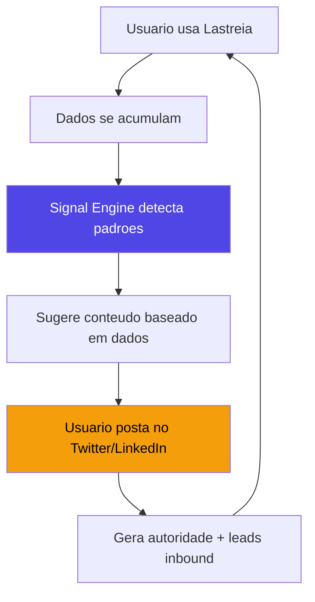

# Signal Engine - O Moat Real do Lastreia

> **Insight central:** Todo SaaS pequeno gera dados comerciais valiosos o tempo todo.
> Ninguem transforma isso em distribuicao. O Lastreia pode.

---

## O Problema que Ninguem Resolveu

```
Dev constroi SaaS excelente
  -> nao sabe vender
  -> nao sabe o que postar
  -> nao sabe quando postar
  -> morre no anonimato

Enquanto isso, no backend do Lastreia dele:
  -> 200 leads contatados
  -> "CTOs respondem 3x mais as tercas"
  -> "Mensagens com case study convertem 47% mais"
  -> "Fintech < 20 funcionarios e o ICP perfeito"

Esses dados EXISTEM. Estao la. Ninguem os usa.
```

O Signal Engine pega esses dados e responde uma pergunta:

> **"O que do seu trabalho comercial vale virar conteudo publico?"**

---

## Como Funciona (3 Camadas)

### Camada 1: Captura de Eventos

Tudo que ja acontece no Lastreia vira um evento tipado:

```typescript
type SignalEvent =
  | { type: "lead_replied";      leadId: string; icp: string; channel: string; dayOfWeek: string; hourOfDay: number }
  | { type: "lead_ignored";      leadId: string; icp: string; channel: string; messageType: string }
  | { type: "lead_converted";    leadId: string; icp: string; daysToConvert: number; touchpoints: number }
  | { type: "campaign_finished"; campaignId: string; replyRate: number; channel: string; segment: string }
  | { type: "objection_received"; leadId: string; objectionType: string; icp: string }
  | { type: "meeting_booked";    leadId: string; icp: string; source: string; channel: string }
  | { type: "best_message";      messageId: string; replyRate: number; channel: string; template: string }
```

**Nao precisa adicionar nada novo.** Esses eventos ja existem nos dados de leads, campanhas, inbox e analytics.

---

### Camada 2: Pattern Detector (Interpretador de Sinais)

O sistema analisa os eventos acumulados e gera **insights estruturados**, nao texto generico:

```typescript
interface DetectedSignal {
  id: string;
  type: SignalType;           // timing | channel | icp | message | objection | conversion
  confidence: number;         // 0-100 (quanto mais dados, maior)
  insightRaw: string;         // "CTOs respondem 3.2x mais as tercas entre 10-12h"
  dataPoints: number;         // baseado em quantos eventos
  suggestedFormats: string[]; // ["tweet", "thread", "chart", "micro_case"]
  rawData: object;            // dados brutos pra gerar visualizacoes
  createdAt: Date;
}
```

#### Exemplos concretos de signals detectados:

| Signal detectado | Dados brutos | Confidencia |
|-----------------|-------------|-------------|
| "CTOs de fintech respondem 3.2x mais as tercas 10h" | 47 replies de 200 sends nesse slot vs 15 replies em outros | 82% |
| "Mensagens que mencionam 'reducao de churn' convertem 2x" | 23 replies vs 12 no grupo controle | 71% |
| "Leads que recebem 3 touchpoints antes de responder" | Media de 3.1 touchpoints em 89 conversoes | 88% |
| "Setor de edtech esta 40% mais responsivo este mes" | Spike de reply rate vs media dos ultimos 3 meses | 65% |
| "WhatsApp converte 47% mais que email pra empresas < 10 func" | 34% reply rate WA vs 23% email no segmento | 76% |

#### Regras de confidencia (pra nao gerar lixo):

```
< 50% confidencia -> Nao mostra (dados insuficientes)
50-70%            -> Mostra como "sinal emergente" ⚡
70-85%            -> Mostra como "insight confirmado" ✅
> 85%             -> Mostra como "padrao forte" 🔥 + sugere post
```

---

### Camada 3: Distribution Generator

Transforma signals em **conteudo pronto pra aprovar** em varios formatos:

#### Formato 1: Tweet (rapido, alta frequencia)

```
Signal: "CTOs de fintech respondem 3.2x mais as tercas 10-12h"

Sugestao gerada:
--
"Analisei 200 outreaches pra CTOs de fintech.

Resultado: mensagens enviadas terca entre 10-12h tem
3.2x mais chance de resposta.

Sexta a tarde? 0.3x.

Timing > copy."
--
```

#### Formato 2: Thread (educativo, build in public)

```
Signal: "Leads que recebem 3 touchpoints convertem mais"

Sugestao gerada:
--
1/ "A maioria dos SDRs desiste no primeiro 'nao'.
   Nossos dados mostram que a media de touchpoints
   antes de uma conversao e 3.1."

2/ "Nao estou falando de spam. E de:
   - Touchpoint 1: valor (insight ou case)
   - Touchpoint 2: contexto (por que agora?)
   - Touchpoint 3: direto (proposta clara)"

3/ "O erro: mandar 3 follow-ups genericos.
   O acerto: cada touchpoint adiciona info nova."

4/ "Dados reais de 89 conversoes. 
   Nenhuma aconteceu no primeiro contato."
--
```

#### Formato 3: Grafico compartilhavel

```
Signal: "Reply rate por horario/dia da semana"

Gera um heatmap tipo:
         Seg  Ter  Qua  Qui  Sex
  08h     ⬜   🟨   ⬜   ⬜   ⬜
  10h     🟨   🟥   🟨   ⬜   ⬜
  12h     ⬜   🟥   🟨   🟨   ⬜
  14h     ⬜   🟨   ⬜   ⬜   ⬜
  16h     ⬜   ⬜   ⬜   ⬜   ⬜

Exportavel como imagem para postar no Twitter/LinkedIn.
```

#### Formato 4: Micro Case Study

```
Signal: "Lead X converteu em 3 dias apos mudar de email pra WhatsApp"

Sugestao gerada:
--
"Case real (dados anonimizados):

- Lead: SaaS B2B, 8 funcionarios, edtech
- 2 emails: sem resposta
- 1 WhatsApp: resposta em 4 min
- Reuniao marcada no mesmo dia

A barreira nao era interesse. Era canal."
--
```

---

## Fluxo do Usuario no Lastreia

```
1. Usuario usa o Lastreia normalmente
   (scraping, campanhas, inbox)
        |
        v
2. Signal Engine roda em background
   (analisa tudo, detecta padroes)
        |
        v
3. Dashboard mostra: "3 novos insights esta semana"
   [Ver insights]
        |
        v
4. Tela de Signals:
   +-------------------------------------------+
   | 🔥 Insight forte (89% confianca)          |
   | "WhatsApp converte 47% mais que email     |
   |  pra empresas < 10 func"                  |
   |                                           |
   | [📝 Gerar tweet] [🧵 Gerar thread]       |
   | [📊 Gerar grafico] [❌ Ignorar]           |
   +-------------------------------------------+
        |
        v
5. Preview do conteudo:
   - Edita se quiser
   - Aprova
   - Copia ou posta direto (se integrar Twitter/LinkedIn)
```

> [!IMPORTANT]
> **Regra absoluta:** NADA e postado automaticamente. O usuario SEMPRE revisa, edita e aprova.
> Isso nao e "IA escreve tweet". E "seus dados te dizem o que postar."

---

## Por que Isso Cria Moat Real

### 1. Data Moat
```
Dia 1:    poucos dados -> insights fracos
Dia 30:   padroes emergem -> insights medios
Dia 90:   confianca alta -> insights precisos
Dia 180:  historico unico -> impossivel de copiar
```

Quem copiar o codigo nao copia os 6 meses de dados comerciais reais.

### 2. Network Effect Indireto
```
Usuario posta insight gerado pelo Lastreia
  -> Seguidores veem e perguntam "que ferramenta e essa?"
  -> Novos usuarios entram
  -> Mais dados no sistema
  -> Insights melhores
  -> Mais posts
  -> Mais seguidores
  -> Loop
```

O produto se distribui atraves do conteudo que ele mesmo ajuda a criar.

### 3. Tempo como Vantagem

| Metrica | Dia 1 | Mes 3 | Mes 6 |
|---------|-------|-------|-------|
| Sinais detectados | 0 | 12 | 47 |
| Confianca media | - | 55% | 78% |
| Posts sugeridos | 0 | 8 | 35 |
| Distribuicao gerada | 0 | 2k impressoes | 50k impressoes |

Quanto mais tempo usando, mais impossivel de substituir.

---

## Diferencial vs "IA que escreve tweet"

| "IA genrica" | Signal Engine |
|-------------|---------------|
| Texto baseado em nada | Texto baseado em SEUS dados reais |
| Todo mundo pode ter | So voce tem seus dados |
| Conteudo generico | Conteudo com numeros reais |
| Nao gera autoridade | Gera autoridade tecnica |
| Qualquer um copia | Impossivel copiar (sem os dados) |

---

## Integracao com o Pool Compartilhado

O Signal Engine fica ainda mais poderoso com o Lead Pool:

```
Dados individuais da org: 200 leads
  -> "CTOs respondem mais as tercas" (confianca 65%)

Dados do pool (todas as orgs anonimizados): 50.000 leads
  -> "CTOs respondem mais as tercas" (confianca 94%)
  -> Insight muito mais forte
  -> Post muito mais impactante
```

O usuario pode opt-in pra receber **sinais agregados** do pool inteiro, sem nunca ver dados de outras orgs.

---

## Posicionamento Final

### Antes (1 perna)
```
Lastreia = ferramenta de prospeccao
```

### Depois (3 pernas)
```
Lastreia = prospeccao + aprendizado + distribuicao

Perna 1: Captura leads e contata (como ja faz)
Perna 2: Aprende padroes do SEU mercado (Signal Engine)
Perna 3: Transforma aprendizado em visibilidade (Distribution)
```

### Tagline

> **"Your sales system should speak in public."**

Ou em portugues:

> **"Seu sistema comercial deveria falar em publico."**

Alternativas:
- "Outbound that generates its own marketing."
- "Turn sales activity into distribution."
- "Signals, not spam."

---

## Roteiro de Implementacao

| Fase | O que | Esforco |
|------|-------|---------|
| **1 - Event Capture** | Tipar eventos existentes no sistema | 2 dias |
| **2 - Pattern Detector** | Queries que detectam padroes nos dados | 3 dias |
| **3 - Signal Dashboard** | Tela que mostra insights com confianca | 2 dias |
| **4 - Content Generator** | Templates de tweet/thread/chart a partir de signals | 3 dias |
| **5 - Preview & Approve** | Tela de edicao + copia/exporta | 1 dia |
| **6 - Heatmap Export** | Gerar imagem de grafico compartilhavel | 2 dias |

**Total: ~13 dias**

Fases 1-3 ja entregam valor (usuario ve insights).
Fases 4-6 entregam a distribuicao (usuario posta).

---

## O Ciclo Virtuoso Completo



**O Lastreia se torna a unica ferramenta que gera seus proprios clientes.**

Isso nao e feature. E modelo de negocio.
